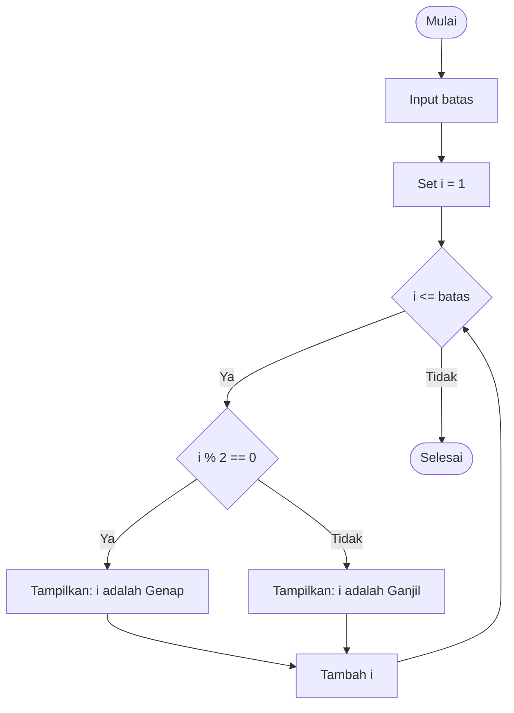

# Algoritma Cek Ganjil Genap (PHP)

Algoritma untuk menentukan apakah suatu angka termasuk bilangan ganjil atau genap menggunakan loop FOR. Algoritma ini menggunakan operator modulo (%) untuk menghitung sisa hasil bagi dengan 2.

---

## 📊 Flowchart Cek Ganjil Genap

---

## 📝 Penjelasan Singkat Flowchart

1. Program dimulai dengan menerima input batas angka
2. Variabel `i` diinisialisasi dengan nilai 1
3. Loop akan berjalan selama `i` kurang dari atau sama dengan `batas`
4. Setiap angka dicek menggunakan operator modulo: `i % 2`
5. Jika hasil modulo sama dengan 0, maka angka adalah genap
6. Jika hasil modulo tidak sama dengan 0 (yaitu 1), maka angka adalah ganjil
7. Variabel `i` ditambah 1 untuk iterasi berikutnya
8. Proses berulang hingga semua angka selesai dicek
9. Program berakhir

---
